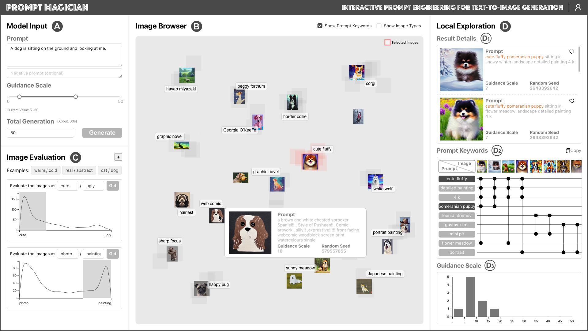

# PromptMagician: Interactive Prompt Engineering for Text-to-Image Creation

[Paper](https://arxiv.org/abs/2307.09036) | Authors: [Yingchaojie Feng](https://yingchaojiefeng.github.io/), [Xingbo Wang](https://andy-xingbowang.com/), [Kam Kwai Wong](https://jasonwong.vision/), Sijia Wang, Yuhong Lu, Minfeng Zhu, Baicheng Wang, [Wei Chen](http://www.cad.zju.edu.cn/home/chenwei/)



Generative text-to-image models have gained great popularity among the public for their powerful capability to generate high-quality images based on natural language prompts. However, developing effective prompts for desired images can be challenging due to the complexity and ambiguity of natural language. This research proposes PromptMagician, a visual analysis system that helps users explore the image results and refine the input prompts. The backbone of our system is a prompt recommendation model that takes user prompts as input, retrieves similar prompt-image pairs from DiffusionDB, and identifies special (important and relevant) prompt keywords. To facilitate interactive prompt refinement, PromptMagician introduces a multi-level visualization for the cross-modal embedding of the retrieved images and recommended keywords, and supports users in specifying multiple criteria for personalized exploration. Two usage scenarios, a user study, and expert interviews demonstrate the effectiveness and usability of our system, suggesting it facilitates prompt engineering and improves the creativity support of the generative text-to-image model.

## How to run the system

The environment setups include frontend (react 18.2.0, d3 7.8.2), and backend (python 3.7 or above).

1. Install Python packages (suggest using conda for package management):

```
cd back-end
pip install -r requirements.txt
```

2. Download DiffusionDB 2m_first_100k (we use DiffusionDB as image retrieval database).

```
python /diffusionDB/download.py
```

3. Download [pre-processed data](https://drive.google.com/drive/folders/1QO_x7irfRAOgdPO8FYMZL-CZ4vlGveqJ?usp=sharing) (for DiffusionDB 2m_first_100k and GPU environments) and move the folds to back-end/.cache directory. You can also create your own version by referring to the [workflow.py](https://github.com/YingchaojieFeng/PromptMagician/blob/main/back-end/server/workflow.py).

4. set up backend (configure [config.py](https://github.com/YingchaojieFeng/PromptMagician/blob/main/back-end/server/config.py) and [run_sd.sh](https://github.com/YingchaojieFeng/PromptMagician/blob/main/back-end/server/run_sd.sh) first, we use 8 GPUs by default).

```
cd server
sh run_sd.sh
python server.py
```

5. set up frontend.

```
cd front-end
npm install
npm start
```

## How to cite

If this paper and tool helps your research projects, please considering citing our [paper](https://arxiv.org/abs/2307.09036):

```
@article{feng2023promptmagician,
  title={PromptMagician: Interactive Prompt Engineering for Text-to-Image Creation},
  author={Feng, Yingchaojie and Wang, Xingbo and Wong, Kam Kwai and Wang, Sijia and Lu, Yuhong and Zhu, Minfeng and Wang, Baicheng and Chen, Wei},
  journal={arXiv},
  year={2023},
  doi={10.48550/arXiv.2307.09036},
}
```